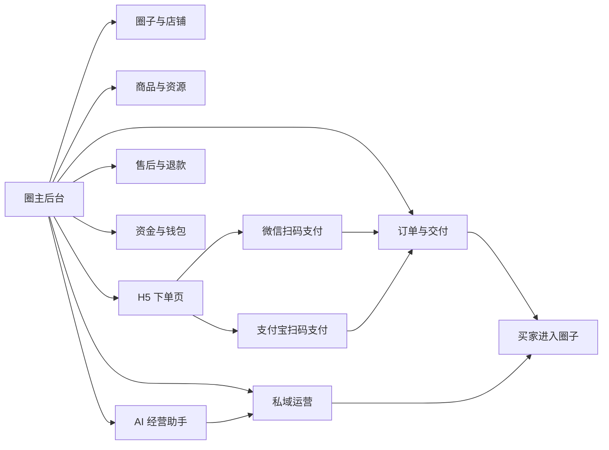
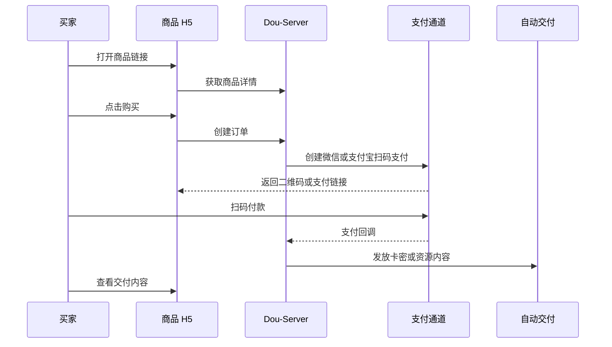

# Dou 圈主商业后台能力整合方案

最后更新：2026-05-28

## 一句话目标

把 Dou 小程序里的圈子、资源卡、订单、售后、钱包、通知和私域运营能力，逐步搬进 PC 后台，形成一个面向普通卖货用户的“小而美”经营系统。

我们的宗旨是：人人都可以当老板。

Dou 后台不是只做平台管理，也不是只做一个发卡站。它要让一个普通用户在没有技术团队、没有复杂系统认知的情况下，可以完成：

1. 创建自己的圈子和店铺。
2. 发布资源、卡密、知识内容、数字权益或服务型商品。
3. 生成可独立传播的 H5 下单页。
4. 用微信或支付宝扫码收款。
5. 自动交付、处理售后、查看资金和订单。
6. 通过圈子沉淀买家，后续用 AI 分析和运营工具提升复购。

## 长期研发模式

从 P0 到 P5 全部采用“先设计文档，后代码实现”的模式。任何阶段只要进入新能力开发，都必须先确认设计文档已经足够支撑实现，再开始写代码。

执行原则：

1. 每个 P 阶段先补足设计：范围、非范围、角色权限、数据模型、接口契约、页面状态、风控合规、验收标准、回滚方案。
2. 涉及支付、退款、提现、H5、内容安全、AI、第三方平台接口时，必须先查官方文档，把关键链接和约束写入设计文档。
3. GitHub 只作为工程实现参考，用于查 SDK 示例、社区踩坑、开源实践；不能代替官方接口契约。
4. 文档不足时不急着写代码；先把文档补到能回答“谁能操作、改哪些表、调哪些接口、失败如何恢复、如何验收”。
5. 所有实现都按生产级和商业级要求推进：租户隔离、权限审计、内容安全、资金幂等、回调验签、对账、回滚点、UTF-8 检查和必要构建/类型检查。
6. 每次阶段性完成后同步更新本地记忆库和仓库续航文档，再提交推送有改动仓库。

本地长期记忆已经同步到：

- `C:\Users\Vincent\.codex\skills\vincent-dou-default\SKILL.md`
- `C:\Users\Vincent\.codex\skills\dou-commerce-production-workflow\SKILL.md`
- `C:\Users\Vincent\Desktop\Dou-Circle\docs\CODEX_CONTINUITY_STATE.md`
- `C:\Users\Vincent\Desktop\Dou-Circle\docs\CODEX_TASK_LEDGER.md`

### P0-P5 详细设计文档索引

以下文档作为后续写代码的直接依据。总方案只保留路线图和产品取舍，具体字段、接口、页面、验收和回滚以对应阶段文档为准。

| 阶段 | 设计文档 | 当前结论 |
| --- | --- | --- |
| P0 后台商业化基础 | `docs/CREATOR_COMMERCE_P0_FOUNDATION_IMPLEMENTATION_DESIGN.md` | 已补到可编码粒度，继续完成 P0 剩余代码 |
| P1 商品中心与 H5 商品页 | `docs/CREATOR_COMMERCE_P1_PRODUCT_H5_DESIGN.md` | 已补到可编码粒度，编码前需确认 H5 承载方式和域名 |
| P2 H5 扫码支付 | `docs/CREATOR_COMMERCE_P2_SCAN_PAY_DESIGN.md` | 已补到可编码粒度，编码前需准备微信/支付宝生产或测试参数 |
| P3 售后风控资金闭环 | `docs/CREATOR_COMMERCE_P3_AFTERSALE_RISK_FUNDS_DESIGN.md` | 已补到可编码粒度，编码前需确认已提现订单退款策略 |
| P4 运营工具与分销 | `docs/CREATOR_COMMERCE_P4_OPERATIONS_DISTRIBUTION_DESIGN.md` | 已补到可编码粒度，首版限制为小而美运营闭环 |
| P5 AI 经营助手 | `docs/CREATOR_COMMERCE_P5_AI_ASSISTANT_DESIGN.md` | 已补到可编码粒度，编码前需复核 OpenAI 官方模型和隐私文档 |
| 平台营收与手续费 | `docs/CREATOR_COMMERCE_PLATFORM_REVENUE_DESIGN.md` | 已补到产品和账务设计粒度，后续实现前需确认最终套餐价格和默认费率 |

### 官方文档优先清单

以下是当前阶段已确认需要优先参考的官方或平台文档。后续每进入一个具体模块，需重新打开官方文档确认接口是否变化，并把具体结论写入对应 P 阶段设计。

| 领域 | 优先文档 | 用途 |
| --- | --- | --- |
| 微信 Native 支付 | [微信支付 Native 下单](https://pay.wechatpay.cn/doc/v3/merchant/4012791877) | P2 微信扫码支付下单、`code_url`、请求参数和验签 |
| 微信订单状态 | [微信支付 Native 开发指引](https://pay.wechatpay.cn/doc/v3/partner/4012076269) | P2 支付状态流转、查单、关单、支付成功回调策略 |
| 支付宝当面付 | [alipay.trade.precreate](https://developer.alibaba.com/docs/api.htm?apiId=862&docType=4) | P2 支付宝扫码支付预下单、`qr_code`、异步通知和错误码 |
| 前端路由 | [Vue Router 官方文档](https://router.vuejs.org/zh/) | H5 商品页、后台通知跳转、筛选参数和路由守卫 |
| 后台表单 | [Element Plus Form](https://element-plus.org/en-US/component/form) | Dou-Admin 商品、店铺、支付配置等复杂表单校验 |
| AI 能力 | [OpenAI Responses API](https://platform.openai.com/docs/api-reference/responses)、[OpenAI 模型文档](https://platform.openai.com/docs/models)、[结构化输出](https://platform.openai.com/docs/guides/structured-outputs) | P5 模型选择、提示词升级、结构化输出、成本控制和回退策略 |

### P 阶段文档门禁

| 阶段 | 写代码前必须补齐的文档 |
| --- | --- |
| P0 后台商业化基础 | 商品/店铺写操作、权限审计、套餐只读、通知跳转、全角色验收矩阵 |
| P1 商品中心和 H5 商品页 | 公开商品接口、分类模型、公开链接/二维码、H5 页面状态、订单草稿边界 |
| P2 H5 扫码支付 | 微信/支付宝下单、回调验签、查单、关单、退款关联、支付意图、对账和幂等 |
| P3 售后风控资金闭环 | 售后时序、平台介入、补发/换卡密、退款触发、黑名单、结算提现对账 |
| P4 运营工具和分销 | 优惠券、邀请码、活动、渠道归因、代理分销、库存预警、反作弊 |
| P5 AI 经营助手 | 数据源、隐私边界、模型选择、成本、人工确认点、AI 不得直接改资金/库存/权限 |

### 当前文档成熟度

| 阶段 | 当前状态 | 是否允许直接写代码 | 下一步文档动作 |
| --- | --- | --- | --- |
| P0 | 独立设计文档已覆盖店铺资料、商品中心、通知跳转、权限审计、验收和回滚 | 允许 | 按 P0 文档完成剩余代码和验收 |
| P1 | 独立设计文档已覆盖分类、公开接口、H5 页面、订单草稿、字段边界和回滚 | 允许 | 编码前确认 H5 承载方式、域名和部署路径 |
| P2 | 独立设计文档已覆盖微信/支付宝扫码支付、支付意图、回调验签、查单关单、对账和幂等 | 允许 | 编码前填入微信/支付宝生产或测试参数 |
| P3 | 独立设计文档已覆盖售后动作、平台介入、补发换卡密、风控、退款、对账和资金回滚 | 允许 | 编码前确认已提现订单退款策略和风控阈值 |
| P4 | 独立设计文档已覆盖优惠券、邀请码、活动、渠道归因、分销、库存预警和反作弊 | 允许 | 编码时首版只实现一个可闭环运营路径 |
| P5 | 独立设计文档已覆盖数据边界、模型策略、提示词版本、结构化输出、成本和人工确认点 | 允许 | 编码前复核 OpenAI 官方最新模型和数据政策 |

当前执行顺序：

1. 按 P0 设计完成剩余代码和回归，完成后双端提交推送并更新续航。
2. P0 完成后进入 P1 商品中心与 H5 商品页代码实现，先确认 H5 承载方式。
3. P1 完成后进入 P2 支付代码实现，支付参数缺失时先完成 mock 和可本地验证部分。
4. P2 完成后进入 P3 售后风控资金闭环。
5. P3 完成后进入 P4 运营工具与分销。
6. P4 完成后进入 P5 AI 经营助手；涉及模型时必须再次复核官方文档。

## 对标对象和取舍

本方案参考本地资料《链动小铺平台商家开店指引（新版）》中的核心能力：快速注册开店、支付宝/微信收款通道、店铺设置、独立店铺链接、商品分类、商品发布、卡密库存、订单管理、售后投诉、主动退款、钱包资金、微信通知、代理分销、店铺 DIY。

Dou 第一阶段先模仿它的交易闭环，不盲目复制所有配置项。链动小铺更像“合规发卡和虚拟商品寄售平台”，Dou 应该做成“圈子 + 店铺 + 资源交易 + 私域运营 + AI 经营助手”的轻量系统。

核心取舍：

| 能力 | 链动小铺侧重点 | Dou 要做的版本 |
| --- | --- | --- |
| 开店 | 1 分钟注册、5 分钟开店 | 圈主一键开通店铺，可直接关联已有圈子 |
| 商品 | 卡密、知识文章、资源下载、数字权益 | 资源卡升级为商品中心，兼容卡密、资源、知识、权益、服务 |
| 支付 | 支付宝/微信直清、自配通道、平台账户 | 先做平台聚合收款 + 圈主钱包，再预留支付宝/微信扫码支付和直清能力 |
| 交付 | 自动发卡、补发、更换卡密 | 自动交付资源链接、卡密、图文内容，后台可补发和禁用 |
| 店铺 | 独立店铺链接和二维码、风格 DIY | 每个圈子有店铺主页，每个资源有独立 H5 下单页 |
| 售后 | 24 小时投诉、协商、退款 | 保留 24 小时售后，接入后台协商、退款、黑名单和风控 |
| 运营 | 微信通知、代理分销、选号、随机售卡 | 先做通知、优惠、邀请码、活动，后续做分销和选号 |
| 差异化 | 发卡交易效率 | Dou 增加圈子沉淀、买家复购、AI 分析和运营建议 |

## 产品定位

Dou 商业后台面向四类用户：

| 用户 | 典型场景 | 后台要解决的问题 |
| --- | --- | --- |
| 新手卖家 | 有资源、有课程、有服务，想快速卖出去 | 不会搭系统，不会配置复杂支付，需要开箱即用 |
| 个人创作者 | 卖知识内容、资料包、社群名额、AI 工具教程 | 需要商品页、自动交付、买家沉淀和复购工具 |
| 小团队 | 有多个商品和运营人员 | 需要子账号、订单、售后、资金、数据分工 |
| 平台运营 | 管理风险、套餐、支付、退款、投诉 | 需要统一治理、审计、财务和租户控制 |

第一版关键词：

- 小而美，不做臃肿 ERP。
- 先卖起来，再精细化。
- 每个商品都能独立成页。
- 每笔交易都能追踪、交付、售后。
- 每个买家都能沉淀进圈子。
- AI 后续作为经营助手，而不是花哨入口。

## 总体架构



建议命名：

- 平台侧：Dou 管理后台。
- 圈主侧：Dou 老板后台。
- 买家侧：Dou 小店 H5。

## 菜单规划

### 圈主后台菜单

| 一级菜单 | 二级菜单 | 说明 |
| --- | --- | --- |
| 工作台 | 经营总览 | 今日订单、收入、待发货、售后、访客、转化 |
| 店铺 | 店铺设置 | 店铺名称、头像、公告、联系方式、风格、打烊、自定义链接 |
| 店铺 | 店铺链接 | 店铺主页链接、二维码、分享海报 |
| 圈子 | 圈子设置 | 关联小程序圈子，维护圈子资料、公告、成员规则 |
| 商品 | 商品分类 | 数字卡密、资源下载、知识文章、数字权益、服务商品 |
| 商品 | 商品管理 | 发布、编辑、上下架、独立链接、库存、预览 |
| 商品 | 卡密库存 | 批量导入、库存预警、补发、更换、禁用 |
| 订单 | 订单列表 | 搜索订单、查看支付、交付、买家信息 |
| 订单 | 交付记录 | 自动交付、补发、失败重试 |
| 售后 | 投诉售后 | 24 小时售后、协商、退款、拉黑 |
| 资金 | 钱包概览 | 可提现、待结算、提现中、累计收入 |
| 资金 | 支付方式 | 支付宝、微信、平台收款、自配通道预留 |
| 资金 | 提现记录 | 提现申请、微信转账状态、失败原因 |
| 运营 | 买家管理 | 买家标签、购买记录、黑名单 |
| 运营 | 优惠工具 | 优惠券、邀请码、活动、复购提醒 |
| 数据 | 经营分析 | 流量、转化、商品排行、退款率、复购 |
| AI 助手 | 经营建议 | 商品诊断、风险提醒、复购人群、文案建议 |
| 设置 | 子账号 | 员工账号、只读账号、权限 |

### 平台后台菜单

| 一级菜单 | 说明 |
| --- | --- |
| 平台总览 | 全局交易、投诉、退款、提现、租户到期 |
| 租户套餐 | 开通圈主后台、套餐、到期、用量限制 |
| 支付通道 | 微信、支付宝、平台收款、费率、风控 |
| 店铺治理 | 店铺审核、违规商品、黑名单 |
| 商品治理 | 资源卡、卡密、内容审核、上下架 |
| 订单售后 | 平台介入售后、退款异常 |
| 资金审核 | 提现审核、对账、异常单 |
| 通知中心 | 投诉、资金、到期、审核待办 |
| 系统安全 | 管理员、审计日志、登录日志 |

## 核心能力拆解

### 1. 开店和圈子关联

目标：用户不需要理解“后台、店铺、圈子、商品”之间的复杂关系，只需要完成一个引导流程。

开店流程：

1. 选择或创建圈子。
2. 设置店铺名称、头像、公告、联系方式。
3. 选择主营类型：卡密、资料包、课程、权益、服务、其他。
4. 开通支付方式，第一期可先走平台聚合收款。
5. 创建第一个商品。
6. 生成店铺链接和商品 H5 下单页。

数据模型建议：

| 表 | 用途 |
| --- | --- |
| `circle_tenants` | 圈主后台租户和套餐 |
| `creator_stores` | 店铺资料，和 `circle_id` 一对一或一对多 |
| `creator_store_settings` | 店铺风格、公告、打烊、客服、手续费承担方 |
| `creator_store_links` | 自定义短链、二维码、分享参数 |

第一阶段可以先不新建 `creator_stores`，使用 `circles` 作为店铺主体，后续再抽离店铺表。

### 2. 商品中心

现有资源卡要升级为商品中心。资源卡继续保留，但后台命名可以叫“商品”或“资源商品”，降低新手理解成本。

商品类型：

| 类型 | 示例 | 交付方式 |
| --- | --- | --- |
| 数字卡密 | 激活码、邀请码、会员码 | 自动发一条卡密 |
| 资源下载 | 网盘资料、源码、素材包 | 交付链接、提取码、说明 |
| 知识文章 | 图文教程、付费笔记 | 付费后展示正文 |
| 数字权益 | 会员充值、工具额度、兑换码 | 卡密或人工确认 |
| 服务商品 | 咨询、陪跑、训练营 | 下单后进入圈子或客服协商 |

商品字段建议：

| 字段 | 说明 |
| --- | --- |
| 标题 | 买家可见，控制在 60 字以内 |
| 分类 | 先分类后发布商品 |
| 封面 | H5 下单页首图 |
| 简介 | 商品亮点和适用人群 |
| 价格 | 单价，单位分 |
| 库存 | 卡密型按可用卡密计数，资源型可选不限库存 |
| 预览 | 购买前可见图片或文字 |
| 交付内容 | 购买后可见 |
| 售后规则 | 默认 24 小时内可申请售后 |
| 独立链接 | 每个商品自动生成 H5 下单页 |
| 状态 | 草稿、已上架、已下架、禁用、删除 |
| 审核状态 | pending、pass、reject、manual_review |

### 3. 卡密库存

对标链动小铺的发卡能力，Dou 必须补强卡密库存管理。

第一阶段功能：

1. 一行一个卡密批量导入。
2. 支持 TXT 导入和文本框粘贴。
3. 可查看总库存、可售库存、已售库存、禁用库存。
4. 支持单条禁用、批量禁用。
5. 售后退款后自动禁用已发卡密。
6. 支持订单详情里补发或更换卡密。

后续增强：

1. 卡号 + 卡密双字段。
2. 选号售卡，买家可以选择指定卡密。
3. 随机售卡，系统随机分配。
4. 卡密有效期。
5. 库存预警和通知。

### 4. H5 独立下单页

这是对标链动小铺的关键。小程序适合社区和沉淀，H5 适合传播和成交。

每个商品必须有独立下单页：

```text
https://shop.doucatapp.top/p/{product_id}
https://shop.doucatapp.top/s/{store_slug}
```

页面结构：

1. 商品封面和标题。
2. 价格、销量、库存。
3. 商品简介和预览内容。
4. 售后规则和交付说明。
5. 支付按钮：微信扫码、支付宝扫码。
6. 购买后跳转订单详情。
7. 引导加入圈子或关注后续更新。

H5 下单链路：



第一阶段 H5 不做复杂登录，可以用订单号 + 支付手机号/邮箱/取货码查看订单。后续再做微信授权登录、支付宝授权登录。

### 5. 支付方式

支付能力要分三层设计，避免第一版被资质和直清复杂度拖死。

| 阶段 | 支付方案 | 适用场景 |
| --- | --- | --- |
| P1 | 平台聚合收款，圈主钱包结算 | 先快速跑通交易闭环 |
| P2 | 微信扫码支付、支付宝扫码支付 | H5 订单页标准扫码支付 |
| P3 | 圈主直清或服务商分账 | 优质商家、长期经营、合规增强 |
| P4 | 自配支付通道 | 高级商家自有通道 |

P1 继续使用现有 Dou 钱包和提现吗逻辑：

1. 买家付款进入平台收款。
2. 订单履约后生成圈主收益。
3. 售后期内按规则冻结或待结算。
4. 圈主发起提现。
5. 平台通过微信商家转账或后续支付宝转账打款。

P2 H5 扫码支付：

| 通道 | 后台配置 | 买家体验 |
| --- | --- | --- |
| 微信支付 | 平台商户号、AppID、Native/H5 支付参数 | H5 展示微信支付二维码，买家扫码 |
| 支付宝支付 | 应用 AppID、商户私钥、公钥、当面付/电脑网站支付 | H5 展示支付宝二维码，买家扫码 |

支付状态：

- `created`：订单创建。
- `paying`：已生成支付二维码。
- `paid`：支付成功。
- `delivered`：已交付。
- `refunding`：退款中。
- `refunded`：已退款。
- `closed`：超时关闭。

### 6. 订单和交付

订单列表要让圈主一眼看清楚：

| 信息 | 说明 |
| --- | --- |
| 订单号 | 可复制，可搜索 |
| 商品 | 标题、类型、分类 |
| 买家 | 昵称、联系方式、来源 |
| 金额 | 实付、优惠、退款 |
| 支付 | 通道、支付单号、支付时间 |
| 交付 | 自动交付状态、卡密或资源 |
| 售后 | 是否有投诉、处理状态 |
| 来源 | 店铺页、商品独立页、邀请码、圈子 |

交付策略：

1. 支付成功后自动交付。
2. 卡密商品锁定一条未售卡密并发放。
3. 资源商品展示购买后内容。
4. 知识文章展示付费正文。
5. 服务商品生成待履约记录，提醒圈主处理。
6. 交付失败时进入待处理队列。

### 7. 售后投诉

沿用当前资源卡售后能力，升级为商品售后中心。

规则建议：

1. 买家付款后 24 小时内可申请售后。
2. 买家提交原因、说明、图片凭证、联系方式。
3. 圈主可在后台协商、回复、补发、更换卡密、主动退款。
4. 平台可介入裁决。
5. 退款成功后自动关闭交付权限，卡密禁用。
6. 恶意买家可加入黑名单。

售后状态：

- `open`：处理中。
- `buyer_withdrew`：买家撤销。
- `refunded`：已退款。
- `rejected`：已拒绝。
- `platform_review`：平台介入。
- `closed`：已关闭。

### 8. 店铺 DIY

小而美版本不要做复杂装修，先做能显著提升信任感的配置。

第一阶段：

1. 店铺头像、名称、简介。
2. 公告。
3. 客服联系方式。
4. 店铺状态：营业中、打烊。
5. 自定义短链。
6. 分享二维码。
7. 店铺主题：简洁、纸感、深色。

第二阶段：

1. 引导页。
2. 自定义按钮：加群、下载、客服、公众号。
3. 背景图。
4. 商品分组展示。
5. 店铺信誉展示：保证金、成交数、退款率、服务响应。

### 9. 通知提醒

右上角通知要服务圈主后台日常工作，而不是模板消息。

通知类型：

| 类型 | 示例 | 跳转 |
| --- | --- | --- |
| 投诉举报 | 有新的商品投诉、圈子举报 | 举报处理、售后详情 |
| 资金相关 | 提现待审核、退款待确认、支付异常 | 提现审核、售后退款 |
| 到期相关 | 套餐到期、支付通道授权到期、库存不足 | SaaS 套餐、支付方式、库存 |
| 经营相关 | 新订单、新售后、库存预警 | 订单、售后、商品 |
| 安全相关 | 异地登录、子账号异常 | 登录日志、账号安全 |

点击通知必须跳转到对应菜单，并带上必要筛选条件。第一版可先跳转菜单，第二版再支持 query 定位。

### 10. AI 经营助手

AI 不作为第一阶段交易闭环的前置依赖，但要提前预留数据结构和入口。

AI 能力方向：

| 能力 | 圈主价值 |
| --- | --- |
| 商品诊断 | 标题、价格、简介、封面、转化建议 |
| 订单分析 | 哪些商品好卖，哪些渠道转化高 |
| 售后分析 | 投诉原因归类，识别高风险商品 |
| 买家分层 | 新客、复购、沉默、高价值买家 |
| 复购建议 | 给哪些人发优惠券，推什么商品 |
| 文案生成 | 商品简介、公告、活动文案 |
| 风险提醒 | 卡密库存低、退款率异常、支付投诉高 |
| 经营日报 | 每日收入、订单、售后、待办摘要 |

AI 入口不应做成一个空聊天框。更适合在后台各页面内提供“分析一下”“优化文案”“生成日报”“找出风险”。

## 分阶段落地计划

### P0 后台商业化基础

状态：核心骨架已落地，继续按生产级和商业级标准收口。

P0 的定位不是直接做 H5 扫码支付，也不是一次性重构成完整电商系统。P0 要先把 Dou-Admin 的圈主后台打磨成一个可信的经营中枢：账号安全、套餐约束、租户隔离、商品/资源管理、订单售后、钱包提现、通知待办、审计记录都可用且边界清楚。P0 做扎实后，P1 商品中心和 P2 H5 扫码支付才有稳定地基。

目标：

1. 后台账号权限完善。
2. SaaS 套餐、到期、只读保护。
3. 圈主工作台、资源、订单、售后、钱包基础管理。
4. 右上角通知提醒。
5. 将“资源卡”在后台语义上收敛为“商品中心”的前置能力，但数据层优先复用现有 `resource_cards`。
6. 为后续 H5 独立下单页预留商品公开链接、店铺主体和订单来源字段，不在 P0 改动真实支付终态。

#### P0 已具备能力基线

| 模块 | 当前能力 | P0 收口要求 |
| --- | --- | --- |
| 后台账号 | 管理员、圈主账号、子账号、只读账号、强制改密、登录失败锁定 | 权限变更后旧 token 失效，登录日志可查 |
| 租户套餐 | `circle_tenants`、套餐、到期时间、用量统计 | 到期或暂停后写操作只读保护，数据继续可读 |
| 圈主工作台 | 圈子、成员、资源、订单、售后、钱包概览 | 所有指标按 `scope_circle_id` 隔离 |
| 资源经营 | 圈内资源列表、状态、销量、收入、库存摘要 | 后台命名逐步转为“商品”，但保持小程序资源卡兼容 |
| 订单售后 | 订单列表、售后列表、微信退款状态 | 圈主只处理自己圈子的订单售后，平台可介入 |
| 钱包提现 | 钱包概览、提现申请、平台提现审核 | 圈主后台只发起提现，不直接修改资金终态 |
| 通知提醒 | 举报、复核、售后、提现、套餐到期聚合 | 通知点击必须跳到对应页面并带筛选参数 |
| 审计日志 | 管理员关键动作记录 | P0 新增写操作必须记录审计动作 |

#### P0 不做的事情

1. 不接入 H5 微信 Native 支付和支付宝当面付。
2. 不允许后台手动把未支付订单改成已支付。
3. 不允许圈主后台直接修改钱包余额、结算状态或退款终态。
4. 不做复杂店铺装修、分销、优惠券、AI 自动运营。
5. 不把 `resource_cards` 立即迁移成全新的 `commerce_products`，避免破坏小程序端购买闭环。

#### P0 数据模型设计

P0 优先复用现有表，少量补充字段或配置，为 P1/P2 铺路。

| 表 | P0 用法 | 是否新增 |
| --- | --- | --- |
| `circles` | 暂作为店铺主体，圈子名称/头像/公告即店铺基础资料 | 复用 |
| `circle_tenants` | 圈主后台租户、套餐、状态、到期和只读保护 | 复用 |
| `tenant_plans` | 套餐功能开关和用量上限 | 复用 |
| `admin_users` | 圈主账号、子账号、只读账号和会话版本 | 复用 |
| `resource_cards` | P0 后台商品中心的数据源 | 复用，必要时追加轻量字段 |
| `resource_card_codes` | 卡密库存 | 复用 |
| `orders` | 商品/资源卡订单 | 复用，后续可追加 `source_channel`、`buyer_contact` |
| `resource_after_sales` | 商品售后 | 复用 |
| `creator_wallets` / `creator_withdrawals` | 钱包、提现 | 复用 |
| `admin_audit_logs` | 后台审计 | 复用 |

P0 若需要新迁移，优先采用兼容字段而非新大表：

| 字段 | 表 | 说明 |
| --- | --- | --- |
| `store_slug` | `circle_tenants` 或后续 `creator_stores` | 店铺短链预留，P0 可为空 |
| `store_status` | `circle_tenants` | `open` / `closed` / `readonly`，用于后台展示 |
| `source_channel` | `orders` | `miniapp` / `admin_preview` / `h5`，P0 先为后续 H5 预留 |
| `share_token` | `resource_cards` | 商品公开链接短标识，P0 可由 `id` 兜底 |

字段是否实际新增以代码落地时的最小必要为准。若当前功能能用 `id` 和已有状态安全实现，P0 不强行迁移。

#### P0 后端接口设计

圈主后台接口继续走 `/api/admin/tenant/*`，由 `requireTenantScope` 和 `requireAdminPermission` 做圈子隔离与权限判断。

| 接口 | 方法 | 说明 | P0 要求 |
| --- | --- | --- | --- |
| `/api/admin/tenant/dashboard` | GET | 圈主工作台 | 返回套餐、用量、钱包、待办，自动同步过期状态 |
| `/api/admin/tenant/circle` | GET/PATCH | 店铺/圈子资料 | PATCH 必须走 `assertTenantWritable` 和审计 |
| `/api/admin/tenant/members` | GET | 成员列表 | 只读账号可看，不可改 |
| `/api/admin/tenant/resource-cards` | GET | 商品/资源列表 | 支持关键词、状态、交付方式、库存和收入摘要 |
| `/api/admin/tenant/resource-cards` | POST | 创建商品 | P0 设计预留，落地时复用资源卡创建逻辑和内容安全 |
| `/api/admin/tenant/resource-cards/:id` | PATCH | 编辑商品 | 必须校验圈子归属、套餐只读、内容安全、审计 |
| `/api/admin/tenant/resource-cards/:id/publish` | POST | 上架商品 | 卡密型必须有可售库存，资源型必须有交付内容 |
| `/api/admin/tenant/orders` | GET | 订单列表 | 仅返回本圈订单，不泄露其他圈数据 |
| `/api/admin/tenant/after-sales` | GET | 售后列表 | 支持 `status=open` 等筛选 |
| `/api/admin/tenant/wallet` | GET | 钱包概览 | 只读 |
| `/api/admin/tenant/withdrawals` | POST | 发起提现 | 走钱包服务，不直接改余额 |
| `/api/admin/notifications/summary` | GET | 右上角通知 | 按角色和圈子范围过滤 |

公共 H5 接口不在 P0 正式开放支付，但可以先定义边界：

| 接口 | 方法 | P0 用途 |
| --- | --- | --- |
| `/api/shop/products/:id` | GET | 公开商品详情预览，只返回公开字段 |
| `/api/shop/products/:id/order-draft` | POST | 创建 H5 订单草稿的设计预留，不进入真实支付 |
| `/api/shop/orders/:id` | GET | 后续取货页预留，P0 不返回私密交付内容 |

#### P0 前端页面设计

P0 页面以 PC 后台高频经营为主，不做营销型落地页。

| 页面 | 路由 | 目标 |
| --- | --- | --- |
| 圈主工作台 | `/tenant/dashboard` | 订单、收入、售后、库存、套餐和待办总览 |
| 店铺/圈子设置 | `/tenant/circle` | 店铺名称、简介、封面、公告、主房间和基础资料 |
| 商品中心 | `/tenant/resources` | 资源卡以“商品”方式管理，支持创建、编辑、上架、下架、库存摘要 |
| 订单售后 | `/tenant/orders` | 订单和售后双 tab，支持通知跳转筛选 |
| 钱包提现 | `/tenant/wallet` | 可提现、待结算、提现中、提现申请 |
| 私域线索 | `/tenant/conversion/leads` | 买家和意向客户沉淀 |
| 转化工具 | `/tenant/conversion/tools` | 欢迎语、邀请码、活动和优惠预留 |

商品中心 P0 的表格字段：

| 字段 | 说明 |
| --- | --- |
| 商品 | 标题、简介、封面 |
| 类型 | 资源交付 / 卡密交付 |
| 价格 | 单位元，服务端以分保存 |
| 库存 | 卡密型展示总库存/可售库存，资源型展示不限或无库存 |
| 销量 | `resource_purchases` 或已支付订单统计 |
| 收入 | 已支付订单金额统计 |
| 状态 | 草稿、已上架、已下架、已禁用 |
| 审核 | pending、pass、reject、manual_review |
| 操作 | 编辑、上架、下架、复制链接、查看订单 |

#### P0 权限和审计规则

| 操作 | `tenant_owner` | `tenant_staff` | `tenant_viewer` | 审计 |
| --- | --- | --- | --- | --- |
| 查看工作台 | 允许 | 允许 | 允许 | 否 |
| 修改店铺/圈子资料 | 允许 | 允许 | 禁止 | 是 |
| 创建/编辑商品 | 允许 | 允许 | 禁止 | 是 |
| 上架/下架商品 | 允许 | 允许 | 禁止 | 是 |
| 查看订单售后 | 允许 | 允许 | 允许 | 否 |
| 处理售后/退款 | 允许 | 视权限 | 禁止 | 是 |
| 发起提现 | 允许 | 禁止 | 禁止 | 是 |
| 管理子账号 | 允许 | 禁止 | 禁止 | 是 |

套餐到期、租户暂停、套餐功能关闭时：

1. 查看类接口继续可用。
2. 创建、编辑、上架、提现、私域工具新增等写操作统一返回 `402`。
3. 返回体包含当前套餐状态、到期时间、用量和限制，前端展示只读提示。
4. 平台超级管理员仍可在平台后台修正套餐和状态。

#### P0 生产级校验清单

1. 所有圈主后台查询必须按 `scope_circle_id` 过滤。
2. 所有写操作必须校验套餐可写状态。
3. 所有商品公开字段必须经过内容安全检查。
4. 私密交付字段只在购买后、圈主或管理员视角返回。
5. 卡密型商品上架前必须有可售库存。
6. 订单金额必须以服务端商品价格为准，不能信任前端传价。
7. 已生成支付参数的待支付订单遇到商品改价必须关闭旧单，不能静默改金额。
8. 退款、提现、支付成功只能由专用服务和第三方回调推进终态。
9. 关键写操作必须写 `admin_audit_logs`。
10. 新增中文文案和文档提交前必须做 UTF-8 乱码检查。

验收：

- 圈主能登录后台查看自己的圈子、资源、订单、售后、钱包。
- 套餐到期后写入能力受保护，数据不丢。
- 通知能聚合举报、资金、到期待办，并跳转对应菜单。
- 圈主账号不能访问其他圈子的商品、订单、售后、成员和钱包。
- 只读账号只能查看，不能创建商品、改店铺资料、处理售后或发起提现。
- 商品中心的资源交付和卡密交付都能展示库存、销量、收入和状态。
- 所有 P0 写操作在操作日志中能追溯到账号、对象和摘要。

#### P0 开发顺序

1. 先补接口边界和审计：保证商品/店铺写操作有权限、套餐、内容安全和审计。
2. 再补商品中心页面：创建、编辑、上架、下架、库存摘要和复制公开链接。
3. 再补店铺资料页：用圈子资料承载 P0 店铺设置，不新建复杂装修。
4. 再补通知跳转参数：从通知直达订单、售后、商品、钱包和套餐筛选视图。
5. 最后做回归和文档：圈主、子账号、只读账号、到期租户、平台管理员全路径验收。

#### P0 剩余子项详细设计

##### P0.1 店铺资料页

目标：不新建复杂店铺表，先把圈子资料包装成店铺基础资料，让圈主能在 PC 后台完成“我的店铺”最小经营设置。

路由：

- 前端：`/tenant/circle`，页面标题从“圈子资料”逐步转为“店铺资料”。
- 后端：复用 `/api/admin/tenant/circle` 的 GET/PATCH。

字段：

| 字段 | 数据来源 | P0 行为 |
| --- | --- | --- |
| 店铺名称 | `circles.name` | 必填，沿用圈子名称，修改需内容安全和审计 |
| 店铺简介 | `circles.description` | 必填或建议填写，作为 H5 店铺简介预留 |
| 店铺封面 | `circles.cover_image` | 使用已上传 COS 图片地址，需图片安全校验 |
| 公开展示 | `circles.is_public_square` | 控制小程序广场和后续店铺公开展示 |
| 入圈方式 | `circles.is_private` | 保留圈子访问控制，不影响商品公开链接的 P1 设计 |
| 圈子码 | `circles.circle_code` | 只读展示，用于运营识别 |
| 店铺链接 | P0 先用圈子或后台预览链接 | 可复制，P1 再生成正式 H5 店铺主页 |
| 套餐状态 | `circle_tenants` | 只读展示，到期/暂停时禁止保存 |

接口要求：

1. PATCH 必须 `requireAdminPermission('tenant:store:manage')`，严禁复用 `circle:content:view` 这类只读权限。
2. PATCH 必须按 `scope_circle_id` 过滤，只能改当前租户圈子。
3. PATCH 必须走 `assertTenantWritable`，到期、暂停、只读套餐返回 `402`。
4. 店铺名称、简介必须经过文本安全；封面必须经过图片 URL 安全。
5. 修改成功写 `admin_audit_logs`，`action=tenant.store.update`，记录变更字段。
6. 返回体带套餐限制信息，前端展示只读提示。

前端状态：

1. 正常可编辑：显示保存按钮。
2. 只读账号：字段可看不可改，显示权限提示。
3. 套餐到期或暂停：字段可看不可改，显示续费/联系平台提示。
4. 保存失败：展示后端 `message`，保留表单内容。
5. 图片地址不合规：提示“请使用已上传到平台的图片地址”。

验收：

- owner/staff 可保存店铺名称、简介、封面，viewer 不可保存。
- 到期租户不可保存，但能正常查看资料。
- 修改后操作日志能看到账号、圈子、变更字段和摘要。
- 小程序端圈子展示不被破坏。

##### P0.2 通知跳转筛选

目标：右上角通知点击后直达对应页面，并携带足够筛选参数，让圈主或平台管理员不需要二次查找。

通知来源和跳转：

| 通知类型 | 路由 | Query |
| --- | --- | --- |
| 待处理售后 | `/tenant/after-sales` 或 `/tenant/orders` | `tab=after_sales&status=open` |
| 待确认提现 | `/tenant/wallet` | `status=requested` |
| 套餐到期 | `/tenant/dashboard` | `focus=tenant_plan` |
| 商品审核/违规 | `/tenant/resources` | `audit_status=manual_review` 或 `status=disabled` |
| 平台举报 | `/reports` | `status=pending` |
| 平台提现审核 | `/withdrawals` | `status=requested` |
| SaaS 到期 | `/saas` | `status=expired` |

前端要求：

1. 每个目标页面在 `onMounted` 或路由 query 变化时读取 query 并初始化筛选条件。
2. query 参数只作为筛选，不直接触发写操作。
3. 页面刷新后筛选仍可复现。
4. 不认识的 query 要忽略，避免旧链接导致页面崩溃。
5. 通知点击后不清除通知状态，通知数量仍以服务端聚合为准。

后端要求：

1. `/api/admin/notifications/summary` 继续按权限和 `scope_circle_id` 过滤。
2. 返回每条通知的 `path` 必须是后台可识别路由。
3. 金额、用户、商品等敏感信息只返回摘要，不返回私密交付字段。

验收：

- 平台管理员点击举报、提现、SaaS 到期能进入对应页面并带筛选。
- 圈主账号点击售后、钱包、套餐到期只看到自己圈子的结果。
- viewer 点击通知只进入可查看页面，不出现写按钮。

##### P0.3 全角色验收矩阵

| 场景 | owner | staff | viewer | 到期租户 | 平台管理员 |
| --- | --- | --- | --- | --- | --- |
| 查看工作台 | 允许 | 允许 | 允许 | 允许 | 平台视角 |
| 修改店铺资料 | 允许 | 允许 | 禁止 | 禁止 | 平台后台介入 |
| 创建商品 | 允许 | 允许 | 禁止 | 禁止 | 平台后台治理 |
| 编辑商品 | 允许 | 允许 | 禁止 | 禁止 | 平台后台治理 |
| 上架商品 | 允许 | 允许 | 禁止 | 禁止 | 平台后台治理 |
| 删除商品 | 允许 | 允许 | 禁止 | 禁止 | 平台后台治理 |
| 查看订单 | 允许 | 允许 | 允许 | 允许 | 全平台/按权限 |
| 查看售后 | 允许 | 允许 | 允许 | 允许 | 全平台/按权限 |
| 处理售后 | 允许 | 视权限 | 禁止 | 禁止 | 允许 |
| 查看钱包 | 允许 | 允许 | 允许 | 允许 | 财务后台 |
| 发起提现 | 允许 | 禁止 | 禁止 | 禁止 | 平台审核 |
| 管理子账号 | 允许 | 禁止 | 禁止 | 禁止 | 允许 |
| 查看审计日志 | 平台暂不开放 | 平台暂不开放 | 平台暂不开放 | 平台暂不开放 | 允许 |

P0 完成判定：

1. 上表每个“禁止”都由后端权限或套餐状态兜底，不只靠前端隐藏按钮。
2. 所有“允许”的写操作都能在审计日志中追踪。
3. 到期租户不丢数据，恢复套餐后能继续经营。
4. 平台管理员能治理违规商品、售后、提现和租户状态，但不能绕过资金服务直接改终态。

### P1 商品中心和店铺化

目标：

1. 后台把“资源卡”升级为“商品中心”。
2. 支持商品分类。
3. 商品支持资源、卡密、知识文章三种基础类型。
4. 商品生成独立 H5 下单页。
5. 店铺主页链接和二维码生成。

验收：

- 圈主可在后台创建商品并上架。
- 每个商品有独立链接。
- 买家打开 H5 能看到商品详情并创建订单。

### P2 H5 扫码支付

目标：

1. 接入微信扫码支付。
2. 接入支付宝扫码支付。
3. H5 下单页展示支付二维码。
4. 支付回调后自动交付。
5. 订单详情支持取货和售后入口。

验收：

- 买家可用微信或支付宝扫码完成支付。
- 支付成功后订单状态正确，商品自动交付。
- 支付超时自动关闭订单。

### P3 售后、风控和资金闭环

目标：

1. 商品售后中心统一订单投诉。
2. 圈主后台支持协商、补发、更换卡密、主动退款。
3. 平台后台支持介入裁决。
4. 钱包、结算、提现、退款对账增强。
5. 买家黑名单和恶意投诉风控。

验收：

- 买家 24 小时内可发起售后。
- 圈主可处理售后并发起退款。
- 退款后交付权限和卡密状态正确联动。

### P4 运营工具和分销

目标：

1. 优惠券、邀请码、活动报名接入商品。
2. 买家标签和复购提醒。
3. 简单代理分销：上级商品、代理链接、佣金统计。
4. 商品库存预警和通知。

验收：

- 圈主能创建一个优惠活动并追踪订单来源。
- 买家可通过邀请码或活动链接下单。
- 后台能看到渠道效果。

### P5 AI 经营助手

目标：

1. 经营日报。
2. 商品优化建议。
3. 售后风险分析。
4. 买家分层和复购建议。
5. 活动文案生成。

验收：

- 圈主能一键生成经营日报。
- 后台能给出明确可执行的商品和运营建议。

## 数据表建议

在现有 `resource_cards`、`resource_card_codes`、`orders`、`resource_after_sales` 基础上演进。

建议新增或演进：

| 表 | 说明 |
| --- | --- |
| `creator_stores` | 圈主店铺主体 |
| `creator_store_settings` | 店铺设置 |
| `product_categories` | 商品分类 |
| `commerce_products` | 商品主表，可由 `resource_cards` 演进 |
| `commerce_product_deliveries` | 商品交付配置 |
| `commerce_product_codes` | 卡密库存，可复用现有卡密表 |
| `commerce_orders` | H5 商品订单，可先复用 `orders` |
| `commerce_payment_intents` | 支付二维码、支付通道、过期时间 |
| `commerce_delivery_logs` | 自动交付日志 |
| `buyer_blacklist` | 买家黑名单 |
| `store_visit_events` | 店铺和商品页访问数据 |
| `ai_insight_reports` | AI 经营分析结果 |

第一阶段不一定要一次性建完。建议优先复用现有表，把抽象命名留到 H5 支付上线前统一迁移。

## 风险和边界

### 支付风险

支付宝和微信扫码支付涉及商户资质、回调验签、退款、对账、风控投诉。第一版可以先跑平台聚合收款，H5 支付作为下一阶段独立验收。

### 合规风险

Dou 面向“想卖货”的用户，但不能放任灰黑产、侵权资源、违规卡密。商品发布必须接入内容审核、举报、售后和平台封禁能力。

### 资金风险

不能允许后台直接改资金终态。退款、提现、支付成功都必须通过幂等接口和第三方回调确认。

### 产品风险

不要把后台做成复杂 ERP。第一阶段只做卖货必须路径：开店、发商品、收钱、交付、售后、看钱。

## 小而美版本验收标准

第一版可以认为“成了”的标准：

1. 圈主 10 分钟内能创建店铺和第一个商品。
2. 商品有独立 H5 下单页。
3. 买家能扫码付款。
4. 付款后自动拿到资源或卡密。
5. 圈主能在后台看到订单、交付、售后和收入。
6. 买家有售后入口。
7. 平台能处理投诉、退款、提现和违规商品。
8. 到期、资金、投诉等关键事项能在右上角提醒。
9. 所有敏感操作有审计日志。
10. 后续 AI 分析能基于订单、商品、买家、售后数据自然接入。

## 下一步建议

当前正在做的右上角通知提醒完成后，下一步不要先大改支付。建议先做 P1：商品中心和 H5 独立下单页的设计与接口。

优先级：

1. 把后台资源卡菜单改造成商品中心。
2. 增加商品分类。
3. 每个商品生成 H5 独立链接。
4. H5 先展示商品详情和创建订单，支付按钮先对接现有微信支付能力或 mock。
5. 再进入支付宝/微信扫码支付的正式接入。

## 2026-05-28 P1 首版落地状态

P1 已按“只做 H5 交易前台和订单草稿、不推进真实支付终态”的边界完成首版代码：

1. `Dou-Server` 新增商品分类、H5 分享标识、订单草稿迁移和 `/api/shop/*` 公开接口。
2. `Dou-Admin` 商品中心已支持分类管理、分类筛选、商品分类设置、H5 可见性设置和公开链接复制。
3. H5 店铺页、商品详情页、确认订单页和订单状态页改由 `Dou-Admin` 的 `/shop/*` 公开路由承载；`Dou-uniapp` 不参与本阶段 H5 购买页。
4. H5 公开接口继续隔离交付私密字段，真实扫码支付、支付回调、查单、关单和资金终态仍留到 P2。

下一步进入 P2 前，需确认 H5 生产域名、HTTPS、CORS、微信/支付宝商户白名单以及短链重写方式。
